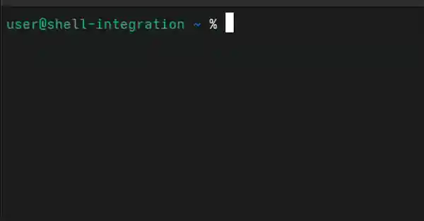

<div align="center">
<h1>terminal-aichat</h1>
</div>


<div align="center"></div>
<div align="center"></div>

终端内AI/LLM聊天的CLI
- 使用Rust编写，轻量级（6.5MB二进制大小），超级快。
- 跨平台（Windows, Linux, MacOS）
- 使用 `/v1/chat/completion` API

```sh
aichat <INPUT MESSAGE>
```

## 快速入门

### 安装


#### sh
```sh
curl --proto '=https' --tlsv1.2 -LsSf https://github.com/ctxinf/terminal-aichat/releases/latest/download/terminal-aichat-installer.sh | sh
```

#### cargo
```sh
cargo install terminal-aichat
```

#### homebrew
```sh
brew install ctxinf/tap/terminal-aichat
```
#### ~~npm~~
>Deprecated, but you can still install version 0.3.5 with it

```sh
npm install terminal-aichat@latest
```
#### powershell
```sh
powershell -ExecutionPolicy Bypass -c "irm https://github.com/ctxinf/terminal-aichat/releases/latest/download/terminal-aichat-installer.ps1 | iex"
```
#### binary
在[Release](https://github.com/ctxinf/terminal-aichat/releases)页面中直接下载二进制程序。

### 前置要求
编辑配置文件来设置provider和models：

```sh
# 首先获取配置文件位置
aichat --list
# 或者直接运行：
aichat

# 然后编辑配置文件（以Linux为例）
nano ~/.config/terminal-aichat/config.jsonc
```

配置文件中包含一个注释掉的示例，您可以取消注释并修改。

### chat
```sh
# 直接发送消息
aichat how to view ubuntu release version

# 如果消息与选项冲突，用引号包裹
aichat "how to use --config option"

# 其他方式
aichat "<INPUT MESSAGE>"
aichat -- <INPUT MESSAGE>

# 管道
cat input.txt | aichat
cat input.txt | aichat "explain this"

# 纯净模式（不显示模型/提示配置和成本信息）
aichat --pure "Hello?"
```

### Shell 集成 (`?` / `?!`)

一行装好，给你的 shell 加两个命令：

```sh
# zsh
eval "$(aichat --init-integration zsh)"
# bash
eval "$(aichat --init-integration bash)"
# fish
aichat --init-integration fish | source
```

| 命令 | 行为 |
| --- | --- |
| `? <问题>` | 问 AI；如果回的是可执行命令，**预填到当前命令行**（你按 Enter 执行），否则用 `###` 包裹原样打印。 |
| `?! <问题>` | 同上，但**自动执行**解析出的命令。每行先以 `# …`（暗色）显示，让你看清要跑什么。 |
| `cmd \| ? "..."` | 通过管道把 stdin 作为额外上下文。 |
| `? --debug ...` | 额外把模型原始回复作为注释显示（仅 `?`）。 |

集成用的提示词会写入配置 `prompts.shell-exec-or-chat`——**可读、可改、可换**（用 `--prompt <name>` 切换）。bash/fish 标准名是 `q` / `qe`（`?` / `?!` 是尽力别名）。

## 配置

### 查看配置

```sh
aichat --list
# 或者
aichat -l
```

这将显示所有已配置的providers、models、prompts以及配置文件位置。

### 编辑配置

通过直接编辑配置文件进行配置（支持注释的JSONC格式）。

配置文件位置（跨平台）：
- Linux: `~/.config/terminal-aichat/config.jsonc`
- macOS: `~/Library/Application Support/terminal-aichat/config.jsonc`
- Windows: `%APPDATA%\terminal-aichat\config.jsonc`

配置文件使用JSONC格式，支持注释。默认配置文件中提供了完整示例。

配置结构示例：
```jsonc
{
  "providers": {
    "openai": {
      "name": "OpenAI",
      "baseURL": "https://api.openai.com/v1",
      "apiKey": "sk-...",
      "models": {
        "gpt-4o": {
          "name": "gpt-4o",
          "temperature": 0.7
        },
        "gpt-5-mini": {
          "name": "gpt-5-mini",
          "temperature": 0.5
        }
      }
    },
    "openrouter": {
      "name": "OpenRouter",
      "baseURL": "https://openrouter.ai/api/v1",
      "apiKey": "sk-or-...",
      "models": {
        "meta-llama/llama-3-70b-instruct": {
          "name": "llama-3",
          "temperature": 0.3
        }
      }
    }
  },
  "prompts": {
    "sample_prompt": {
      "content": "You are a terminal assistant. You are giving help to user in the terminal. Give concise responses whenever possible. Because of terminal cannot render markdown, DO NOT contain any markdown syntax(`,```, #, ...) in your response, use plain text only.\n"
    }
  },
  "default-model": "gpt-5-mini",
  "default-prompt": "sample_prompt",
  "disable-stream": false,
  "pure": false,
  "verbose": false
}
```

### 指定模型

```sh
# 使用特定模型 selector（会搜索所有 providers）
# - model key: "gpt-4o"
# - 或 provider/model_key: "openrouter/meta-llama/llama-3-70b-instruct"
aichat --model gpt-4o "Hello?"

# 或者短格式
aichat -m gpt-5-mini "Hello?"

# 当多个 provider 里存在相同的 model key，或者 model key 本身包含 '/' 时，
# 使用 provider/model_key 来避免歧义：
aichat -m openrouter/meta-llama/llama-3-70b-instruct "Hello?"
```

### 指定提示词

```sh
# 使用特定提示词
aichat --prompt concise "Hello?"

# 或者短格式
aichat -p sample_prompt "Hello?"
```

### 使用自定义配置文件

```sh
# 指定自定义配置文件路径
aichat --config /path/to/config.jsonc --list
aichat --config /path/to/config.jsonc "Hello?"
```

#### 使用临时环境变量指定 api-key
> 如果是需要避免将api-key持久化存储, 或者测试用途, 可以使用`OPENAI_API_KEY`强制覆盖最终发送请求的api-key
```sh
export OPENAI_API_KEY=sk-***************
aichat "Hello?"
```
#### 设置日志级别
```sh
export LOG_LEVEL=DEBUG
```
> 目前, 等同于 `--verbose`

#### 使用纯净模式 (`--pure`)
> 纯净模式不显示任何提示信息

```sh
aichat --pure "Hello?"
```
#### 显示详细日志 (`--verbose`)
```sh
aichat --verbose "Hello?"
```
#### 不使用stream方式调用api (`--disable-stream`)
```sh
aichat --disable-stream "Hello?"
```
